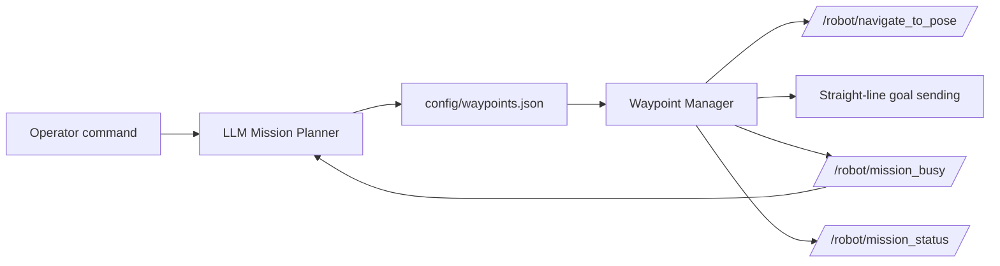

This repo showcases the natural-language mission-planning layer for Outlander.

It connects an LLM-based command interpreter to the waypoint system so an operator can type commands like:

- `move forward 2m`
- `turn left 90 degrees`
- `go to home`
- `stop`
- `resume`

The planner turns those commands into waypoint entries that the rest of the robot stack can execute.

## What it does

The implementation is built around two main ideas:

1. **Interpret human commands**
   - `llm_mission_planner.py` reads operator commands from ROS 2 topics or the terminal.
   - It uses an LLM backend to convert natural language into safe structured steps.

2. **Store and execute waypoints**
   - The generated steps are written into `config/waypoints.json`.
   - `waypoint_manager.py` watches that file and executes the queued mission.

## Main scripts

### `scripts/llm_mission_planner.py`

This is the mission interpreter.

It:
- reads natural language commands
- supports multiple LLM backends
- converts commands into waypoint steps in json format through the LLM prompt
- extract what it needs from the steps and  writes the result to the waypoint file in another format
- publishes mission status updates

### `scripts/waypoint_manager.py`

This is the mission executor.

It:
- watches `config/waypoints.json`
- loads new missions automatically
- supports straight-line motion and Nav2 navigation

### `config/waypoints.json`

This is the live mission queue file.

Both the planner and the waypoint manager use it as the shared handoff point.

### `config/named_destinations.yaml`

This file stores named locations with specific coordinates like:
- home
- base
- bridge
- other fixed destinations if needed

The LLM planner uses it to translate names into actual waypoint targets.

## How everything is connected



In short:

- the operator types a mission command
- the LLM planner converts it into structured waypoints
- the waypoint manager watches the file and executes the mission
- Nav2 handles navigation goals
- the waypoint manager handles straight-line goal sending directly
- the busy/status topics help the planner avoid conflicting commands

## Supported LLM backends

The mission planner can use:

- `ollama`
- `groq`
- `openrouter`
- `gemini`

Set the matching API key or local model host before starting the planner.

## How to launch it

### 1. Build and source the workspace

```bash
colcon build
source install/setup.bash
```

### 2. Start the waypoint manager

```bash
ros2 run outlander_navigation waypoint_manager.py
```

### 3. Start the LLM mission planner

```bash
ros2 run outlander_navigation llm_mission_planner.py
```

### 4. Send commands

You can type commands in the planner terminal, or publish them to the command topic used by the node.

Example:

```bash
ros2 topic pub /robot/mission_command std_msgs/msg/String "{data: 'go to home'}"
```

## Mission flow

Typical use looks like this:

1. Operator gives a natural-language command.
2. `llm_mission_planner.py` interprets it.
3. The planner writes waypoint entries to `config/waypoints.json`.
4. `waypoint_manager.py` detects the update.
5. The waypoint manager sends the mission to Nav2.
6. The robot executes the mission and reports status.

## Notes

- Relative moves like “move forward 2m” require the robot pose from TF.
- Named destinations must exist in `config/named_destinations.yaml`.
- `stop` and `resume` are handled as special commands.
- The waypoint manager and planner both rely on the same shared waypoint file.
- The package expects the rest of the Outlander stack to be available to be fully functional, which all can be found in the outlander_robot repo.
